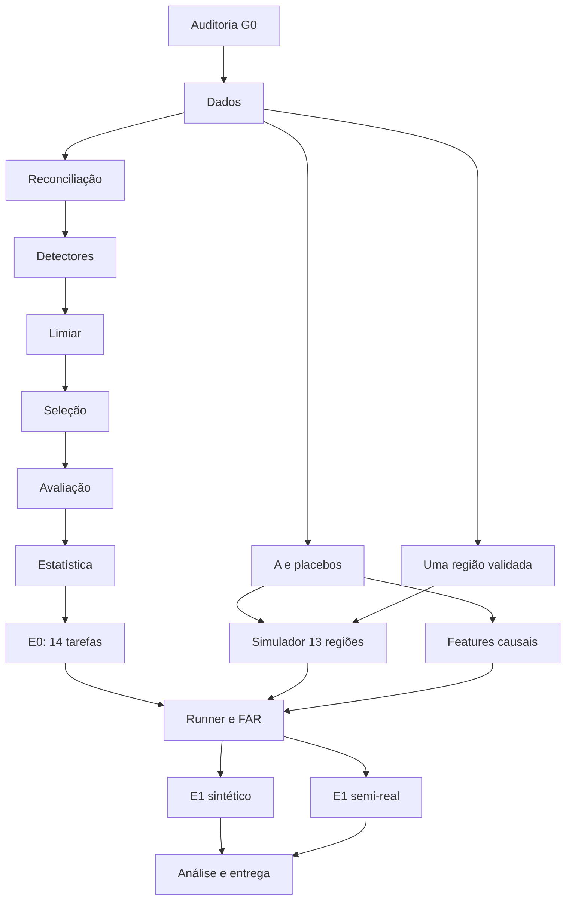

# HEADD-Series L0 Global Implementation Plan

> **For agentic workers:** REQUIRED SUB-SKILL: Use superpowers:subagent-driven-development (recommended) or superpowers:executing-plans to implement this plan task-by-task. Steps use checkbox (`- [ ]`) syntax for tracking.

**Goal:** Entregar uma implementação verificável de E1′ até 16/10/2026, validando B1* sob D-G0/D-E0*, com E0 inconclusivo e comparação com FAR fixa.

**Architecture:** Pacote plano `headd_l0`, componentes numéricos em memória, dataclasses congeladas e configuração TOML. A auditoria do HEAD original separa reprodução de correção metodológica. Grafo/simulador e baseline convergem somente após seus gates.

**Tech Stack:** Python ≥3.12, uv, numpy, pandas, scipy, scikit-learn/PyOD, river, networkx, geobr/geopandas/libpysal, pyarrow, pytest e ruff.

**Spec:** [Arquitetura e decisões](../specs/2026-09-26-headd-l0-architecture.md), [AGENTS.md](../../../AGENTS.md), [README §5](../../../README.md#5--protocolo-experimental-e1).

## Global Constraints

- “Raw data is immutable.”
- “Counts, not proportions.”
- “No look-ahead.”
- “One variable per arm.”
- “Fixed false-alarm rate.”
- Python ≥ 3.12; FAR = 1/60 por região-mês; 13 regiões; 132 meses; 30 placebos.
- “3 ruídos × 3 níveis de ε × (500 T + 500 N) = 9.000 simulações de 13 × 132.”
- “|ΔAUC-PR| ≤ 0.01 per task and the same method ranking.” E0 contém 14 tarefas. D-G0 (27/09) escolheu a saída (i): E0 inconclusivo, B1\* autorizado, gate E0\* antes do E1′.
- Ordem de porte: `data → reconcile → detectors → threshold → select → evaluate → stats`.
- Sem Hydra/OmegaConf, MLflow, DVC, just, Factory/Registry ou Quarto no novo pacote; sem expansão de escopo para resgatar resultado negativo.
- Uma seed raiz, `SeedSequence(root).spawn(n)`, `numpy.random.Generator`; registrar seeds.
- Type hints, docstrings Google, dataclasses congeladas; funções públicas testadas; módulos ≤400 linhas.
- “Commit locally; do not push without explicit instruction.”

## Review Focus

- HEAD sem tabela válida de 14 tarefas: gate deve bloquear, sem inferir paridade de uma média — plano E0, tarefas 1 e 9.
- Dados futuros alterados: outputs anteriores devem permanecer iguais — E0 tarefa 6; L0 tarefa 4; E1 tarefa 1.
- Mês/região ausente versus zero observado: loader rejeita ausência estrutural — E0 tarefa 2.
- Grafo desconexo/sem 30 rewires distintos: produzir erro e diagnóstico — L0 tarefa 1.
- Sem detecção ou onset: preservar censura e denominadores — E0 tarefa 7; E1 tarefa 3.

---

## Situação inicial e caminho crítico

HEAD de referência: `fbfa609bba6cb0b0f2a9e8d73be18022aec319b7`, em `~/projects/hybrid-theory`. O protocolo fornecido já define escopo e finalidade; estes documentos detalham sua execução. As alterações preexistentes em README/pyproject e AGENTS não fazem parte dos commits de planejamento.

**Risco principal:** o HEAD inspecionado não demonstra o baseline descrito. Há diferenças em MinT, FAST-MCD, causalidade, eixos, EVT e avaliação. A [spec §3](../specs/2026-09-26-headd-l0-architecture.md#3-divergências-verificadas-por-leitura-do-head) documenta fontes e decisões. Não há promessa de que E0 possa passar sem revisão do protocolo. A entrega documental está completa mesmo com execução científica condicionada a esse gate.

As trilhas independentes permitem alternar trabalho durante bloqueios; não autorizam subagentes automaticamente. Roteamento do AGENTS é preservado como classificação de tarefa: `think` para teoria, `default` para módulos, `background` para suporte, `longContext` para integração. No harness atual esses nomes não são IDs de modelo.

## Sequência global e critérios de avanço

| Etapa | Plano executável                                                    | Saída verificável                                                                         | Gate                                                                                                                 |
| ----- | ------------------------------------------------------------------- | ----------------------------------------------------------------------------------------- | -------------------------------------------------------------------------------------------------------------------- |
| P0    | [Baseline/E0](2026-09-26-headd-l0-e0.md), tarefa 1                  | Inventário do SHA, dependências, dados, execução mínima e divergências                    | G0: referência suficiente e decisões de baseline explícitas                                                          |
| P1    | Baseline/E0, tarefa 2                                               | Longa, ordem canônica, coerência exata 13→1, hashes                                       | G1: positivos e testes somam ao PA em 132 meses                                                                      |
| P2    | Baseline/E0, tarefas 3–8                                            | Componentes mínimos com testes de paridade/comportamento e MIGRATION                      | Não chamar correções de paridade                                                                                     |
| P3    | Baseline/E0, tarefa 9                                               | Tabela de 14 tarefas, AP por método, ranking e proveniência                               | G2: E0 conforme AGENTS, ou decisão explícita D-G0 por B1\* com E0 inconclusivo; sem decisão, interpretação bloqueada |
| P4    | [L0 e simulação](2026-09-26-headd-l0-graph-simulation.md), tarefa 1 | A/W, mapa, GEXF, 30 grafos válidos e manifest                                             | G3: nomes, graus e conectividade                                                                                     |
| P5    | L0 e simulação, tarefas 2–3                                         | Separação T/N em uma região; CRN e onsets em 13 regiões                                   | G4: validação por ruído, isolamento ε=0 e alcance D-REACH antes dos braços                                           |
| P6    | L0 e simulação, tarefa 4                                            | Representações local/S/vizinhos causais                                                   | G5: invariância de prefixo e mesma representação nos placebos                                                        |
| P7    | [Experimentos](2026-09-26-headd-l0-experiments.md), tarefas 1–2     | Runner TOML, smoke, FAR calibrada em N independente                                       | G6: seeds/partições e única variável por braço                                                                       |
| P8    | Experimentos, tarefas 3–4                                           | Camadas 0/1/2, nulos paramétricos, dimensão D-COST registrada e inferência pré-registrada | G7: protocolo completo, ou conclusão negativa/inconclusiva explícita                                                 |
| P9    | Experimentos, tarefa 5                                              | Notebooks, figuras, tabelas e README reproduzíveis                                        | Entrega da disciplina                                                                                                |

## Agenda de execução e cortes de escopo

| Período     | Prioridade                                                                         | Evidência ao encerrar                                                                                                                         |
| ----------- | ---------------------------------------------------------------------------------- | --------------------------------------------------------------------------------------------------------------------------------------------- |
| 26–27/09    | G0 e dados; deliberar D1–D7 até 29/09, com saída D-G0 explícita                    | Relatório de auditoria e coerência; não consumir a semana tentando ajustar E0                                                                 |
| 28/09–01/10 | S/A/placebos e simulador de uma região; porte sequencial dos componentes liberados | Testes de grafo e validação single-region                                                                                                     |
| 02–06/10    | Piloto ~02/10 após detectores+acoplamento; concluir componentes, G2 e features     | E0 aprovado ou decisão D-G0 explícita por B1\* com E0 inconclusivo; sem rota, interpretação bloqueada; D5 e G4/G5 válidos antes da inferência |
| 07–08/10    | Smoke, calibração independente e confirmação dos custos ainda não medidos          | Tempo/memória medidos; projeção para 9.000 réplicas × 33 braços                                                                               |
| 09–11/10    | Bancadas sintética e semi-real                                                     | Manifests completos, FAR observada e métricas sem seleção de runs                                                                             |
| 12–13/10    | Bootstrap, placebos, estatística real, centralidade                                | ICs e tabelas; gates científicos respeitados                                                                                                  |
| 14–16/10    | Redação e reprodução final                                                         | Metodologia, resultados/limitações, figuras e comandos                                                                                        |

33 braços = B0+B1+B2+30 placebos. Reutilizar dados simulados e ajustes compartilháveis; não simular novamente por braço. Pré-registrar hardware/gatilho de custo e aplicar D-COST antes dos efeitos: (a) placebos em 100T fixas/célula, comparando B2 no mesmo subconjunto e preservando N; (b) 200T+200N/célula; (c) cortar opcionais. Não comparar B2 completo com placebos de um subconjunto nem ocultar o tamanho efetivo.

Camada1 (injeção epidêmica+nulos paramétricos) tem prioridade sobre todos os opcionais. Camada0 (não-inferioridade) não é cortada. Camada3 é qualitativa. Opcionais, em ordem depois da entrega principal: Φ/B3 real, B-Gao, SEIRS de robustez. Nenhum deles justifica atrasar E0, controles, análise ou redação. Não desenvolver implementações vazias desses braços agora. Novas specs/planos delimitados são produzidos se houver tempo e priorização; isso não os torna parte do caminho obrigatório.

## Checklist de execução e encerramento

- [x] Executar P0 e decidir G0: saída (i) em 27/09, E0 inconclusivo e B1\* autorizado; D2, D3, D5 e D6 decididos ([registro](../../protocol-decisions.md)).
- [ ] D-G0a: documentar a proveniência dos resultados apresentados do CDADE v1 em `docs/reference-provenance.md` até 29/09 (somente leitura sobre o original).
- [ ] Executar P1–P3 na ordem de porte; verificar testes e MIGRATION; implementar `inject_original_bounded` e o gate E0\*.
- [ ] Executar P4–P6; verificar validação single-region antes de acoplar.
- [ ] Fixar a faixa de R0 e o perfil do simulador (D-GT2/D-GT4) antes da camada 1; demais decisões da spec §7 congeladas em 27/09.
- [ ] Registrar o hardware (CPU, núcleos, RAM, WSL) em `docs/reference-provenance.md`; executar piloto ~02/10 após detectores+acoplamento; aplicar os gatilhos de 48 h e 96 h da D-COST antes de observar efeitos.
- [ ] Verificar alcance D-REACH antes dos braços; células sem poder não contam como evidência negativa.
- [ ] Avaliar o E0\* na camada 0 antes de qualquer resultado do E1′; executar camadas 0/1/2 e nulos NB2 com FAR e seeds disjuntas; separar E0\*, não-inferioridade e evidência de propagação.
- [ ] Executar P7–P8 com FAR e seeds disjuntas; verificar comparabilidade antes de interpretar lead time.
- [ ] Executar P9; reportar resultados negativos sem expandir o grafo.
- [ ] Em cada componente: teste público, paridade ou comportamento, ruff/format/pytest, config por nome e artefatos pelo runner.
- [ ] Commit local por tarefa; nenhuma publicação/push implícito.

## Revisão deste planejamento

Cobertura: dados, S, baseline, A/W/placebos, simulação, features, injeção, FAR, métricas, estatística, runner e entrega possuem tarefas. Extensões opcionais estão explicitamente adiadas. Assinaturas/tipos são definidos nos planos donos. As cinco classes de falha do Review Focus têm testes atribuídos. Os gates pendentes são decisões científicas identificadas, não tarefas de implementação com “TBD”.

Para executar, revisar primeiro a spec e G0. Recomendo execução nativa da auditoria inicial, pois ela condiciona as interfaces do baseline; depois dela, tarefas de grafo/simulador podem receber revisão independente. A escolha entre execução nativa e por subagentes cabe ao usuário antes de iniciar a implementação.
