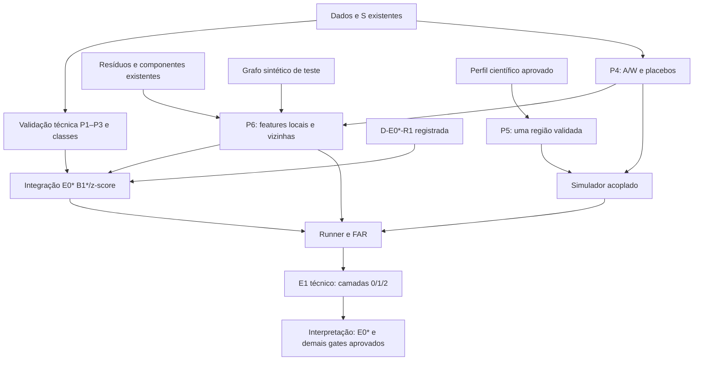

# HEADD-Series L0 Global Implementation Plan

> **For agentic workers:** REQUIRED SUB-SKILL: Use superpowers:subagent-driven-development (recommended) or superpowers:executing-plans to implement this plan task-by-task. Steps use checkbox (`- [ ]`) syntax for tracking.

**Goal:** Entregar uma implementação verificável de E1′ até 16/10/2026, validando B1\* sob D-G0/D-E0*, com E0 inconclusivo e comparação com FAR fixa.

**Architecture:** Pacote plano `headd_l0`, componentes numéricos em memória, dataclasses congeladas e configuração TOML. A auditoria do HEAD original separa reprodução de correção metodológica. Grafo/simulador e baseline convergem somente após seus gates.

**Tech Stack:** Python ≥3.12, uv, numpy, pandas, scipy, scikit-learn/PyOD, river, networkx, geobr/geopandas/libpysal, pyarrow, pytest e ruff.

**Spec:** [Arquitetura e decisões](../specs/headd-l0-architecture.md), [AGENTS.md](../../../AGENTS.md), [README §5](../../../README.md#5--protocolo-experimental-e1).

## Vocabulário de status

Usar os mesmos quatro rótulos nos planos e na arquitetura: `implementado`
(código/artefato existe), `validado tecnicamente` (checks identificados passaram),
`gate aprovado` (todas as condições daquele gate satisfeitas) e
`interpretação autorizada` (todos os gates/decisões aplicáveis satisfeitos).
Identificar o componente/gate; nenhum rótulo implica automaticamente o seguinte.

## Global Constraints

- D-E0*-R1 (28/09) adotou ambas as classes nas 13 regiões; PA é descritivo.
  Scoring Task 0 aguarda tabela de classes/contraste, P1–P3 e features locais P6;
  o código atual ainda usa a regra histórica.
- Toda AUC-PR acompanha prevalência positiva da tarefa, janela e denominador;
  a [decisão histórica PA](headd-l0-e0.md#decisão-pendente-sobre-pa--comparação-regional-selada) define critérios e alternativas.

- “Raw data is immutable.”
- “Counts, not proportions.”
- “No look-ahead.”
- “One variable per arm.”
- “Fixed false-alarm rate.”
- Python ≥ 3.12; FAR = 1/60 por região-mês; 13 regiões; 132 meses; 30 placebos.
- “3 ruídos × 3 níveis de ε × (500 T + 500 N) = 9.000 simulações de 13 × 132.”
- Critério histórico, não gate vigente: “|ΔAUC-PR| ≤ 0.01 per task and the same method ranking.” E0 previa 14 tarefas. D-G0 (27/09) escolheu a saída (i): E0 inconclusivo, B1\* autorizado, gate E0\* antes do E1′.
- Ordem de porte: `data → reconcile → detectors → threshold → select → evaluate → stats`.
- Sem Hydra/OmegaConf, MLflow, DVC, just, Factory/Registry ou Quarto no novo pacote; sem expansão de escopo para resgatar resultado negativo.
- Uma seed raiz, `SeedSequence(root).spawn(n)`, `numpy.random.Generator`; registrar seeds.
- Type hints, docstrings Google, dataclasses congeladas; funções públicas testadas; módulos ≤400 linhas.
- “Commit locally; do not push without explicit instruction.”

## Review Focus

- HEAD sem tabela válida de 14 tarefas: gate deve bloquear, sem inferir paridade de uma média — plano E0, tarefas 1 e 9.
- Dados futuros alterados: outputs anteriores devem permanecer iguais — E0 tarefa 6; L0 tarefa 4; E1 tarefa 1.
- Mês/região ausente versus zero observado: loader rejeita ausência estrutural — E0 tarefa 2.
- Grafo desconexo/sem 30 rewires distintos: produzir erro e diagnóstico — L0 tarefa 1.
- Sem detecção ou onset: preservar censura e denominadores — E0 tarefa 7; E1 tarefa 3.

---

## Situação inicial e caminho crítico

Referência CDADE: `fbfa609bba6cb0b0f2a9e8d73be18022aec319b7`, em
`~/projects/hybrid-theory`. A [PR #1](https://github.com/viniciusnvcosta/net-sci-epi/pull/1)
entregou os componentes corrigidos e a preparação da camada 0. O estado operacional
está em [development](../../development.md); decisões aprovadas prevalecem sobre
roteiros históricos. E0 permanece inconclusivo; o pré-gate histórico falha com `single_class:PA`. D-E0*-R1 ainda não foi implementada nem aprova E0*.

P1–P2: `implementado`, com componentes `validado tecnicamente` pela suíte registrada
no plano E0. P3: preparação `implementado`; comparação completa pendente, sem
`gate aprovado` para E0\* e sem `interpretação autorizada` para E1′.
D-G0a concluiu a busca sem proveniência verificável; hardware já registrado em
[reference-provenance](../../reference-provenance.md). O piloto D-COST ainda falta.



P4 e P6 podem avançar sem o simulador; P6 começa com grafos sintéticos.
P5 agora permite preparação científica, sem escolher parâmetros pendentes.
A comparação regional E0\* aguarda tabela de classes/contraste, P1–P3 e
features locais P6; o código atual ainda usa a regra histórica de 14 tarefas. A autorização B1* de D-G0 não libera interpretação.
As trilhas independentes não autorizam subagentes automaticamente; `think`,
`default`, `background` e `longContext` continuam classificações de tarefas.

## Sequência global e critérios de avanço

| Etapa | Plano / trabalho ativo                                                                    | Saída e condição de avanço                                                                       |
| ----- | ----------------------------------------------------------------------------------------- | ------------------------------------------------------------------------------------------------ |
| P0    | [E0](headd-l0-e0.md), histórico Task 1                                         | Auditoria realizada; D-G0 autoriza B1\*, E0 inconclusivo.                                        |
| P1    | E0, validação ativa P1                                                                    | Longa, hashes, ordem canônica e coerência exata 13→1 em 132 meses (G1).                          |
| P2    | E0, validação ativa P2                                                                    | Componentes existentes; comportamento corrigido separado de paridade de primitivas.              |
| P3    | E0, validação ativa P3; [Experimentos](headd-l0-experiments.md), Task 0 futura | Pré-gate antigo reprovado; Task 0 exige tabela/contraste, P1–P3 e P6. G2 exige E0*. |
| P4    | [Grafo/simulação](headd-l0-graph-simulation.md), Task 1 futura                 | A/W, mapa, GEXF, 30 placebos e manifest; G3: nomes, graus e conectividade.                       |
| P5    | Grafo/simulação, Tasks 2–3 futuras                                                        | Perfil aprovado antes do integrador; uma região antes do acoplamento; G4: ruídos, ε=0 e D-REACH. |
| P6    | Grafo/simulação, Task 4 futura                                                            | Features sobre resíduos; G5: causalidade e mesma representação sob placebos.                     |
| P7    | Experimentos, Tasks 1–2 futuras                                                           | Runner, smoke e FAR; G6: seeds/partições independentes e única variável por braço.               |
| P8    | Experimentos, Tasks 3–4 futuras                                                           | Camadas 0/1/2, nulos, D-COST e inferência; G7 ou conclusão inconclusiva explícita.               |
| P9    | Experimentos, Task 5 futura                                                               | Notebooks, figuras, tabelas e README reproduzíveis.                                              |

## Agenda de execução e cortes de escopo

| Período     | Prioridade                                                          | Evidência / dependência                                                              |
| ----------- | ------------------------------------------------------------------- | ------------------------------------------------------------------------------------ |
| 26–27/09    | Auditoria, componentes e D-G0 realizados                            | Histórico e MIGRATION; sem refazer porte.                                            |
| 28/09–01/10 | Validar P1–P3; iniciar P4/P6 e preparar P5                          | Pré-gate antigo esperado; D-E0*-R1 registrada; perfil ainda pendente. |
| 02–06/10    | Uma região/acoplamento após perfil; Task 0 após tabela/contraste, P1–P3 e P6 | Piloto ~02/10 condicionado ao simulador disponível; G4/G5 e gate E0\* distintos.     |
| 07–08/10    | Smoke, calibração independente e custos                             | Gates prévios satisfeitos; projeção de 9.000 réplicas × 33 braços.                   |
| 09–11/10    | Bancadas sintética e semi-real condicionais                         | Manifests, FAR e gates; não selecionar runs nem prometer desbloqueio.                |
| 12–13/10    | Inferência somente com autorização                                  | Bootstrap, placebos, estatística real e centralidade.                                |
| 14–16/10    | Redação e reprodução final                                          | Entregar também limitações/inconclusão se bloqueios persistirem.                     |

33 braços = B0+B1\*+B2+30 placebos. Reutilizar dados simulados e ajustes compartilháveis; não simular novamente por braço. Pré-registrar hardware/gatilho de custo e aplicar D-COST antes dos efeitos: (a) placebos em 100T fixas/célula, comparando B2 no mesmo subconjunto e preservando N; (b) 200T+200N/célula; (c) cortar opcionais. Não comparar B2 completo com placebos de um subconjunto nem ocultar o tamanho efetivo.

Camada1 (injeção epidêmica+nulos paramétricos) tem prioridade sobre todos os opcionais. Camada0 (não-inferioridade) não é cortada. Camada3 é qualitativa. Opcionais, em ordem depois da entrega principal: Φ/B3 real, B-Gao, SEIRS de robustez. Nenhum deles justifica atrasar E0, controles, análise ou redação. Não desenvolver implementações vazias desses braços agora. Novas specs/planos delimitados são produzidos se houver tempo e priorização; isso não os torna parte do caminho obrigatório.

## Checklist de execução e encerramento

- [x] Executar P0 e decidir G0: saída (i) em 27/09, E0 inconclusivo e B1\* autorizado; D2, D3, D5 e D6 decididos ([registro](../../protocol-decisions.md)).
- [x] D-G0a: busca concluída, sem proveniência verificável; ver `docs/reference-provenance.md`.
- [x] Hardware D-COST registrado (27/09); atualizar somente se o ambiente do piloto mudar.
- [ ] Validar P1–P3 pela sequência ativa do plano E0; não recriar componentes/exportadores.
- [ ] Iniciar P4/P6; testes de features independem de P5.
- [ ] Preparar P5 e aprovar perfil antes do integrador; validar uma região antes de acoplar. Fixar faixa R0 antes da camada 1.
- [x] Registrar D-E0*-R1 datada antes do primeiro commit de integração E0\*; conferir SHA deste commit na Task 0.
- [ ] Antes do scoring Task 0, confirmar tabela regional de positivos/negativos/prevalência e contraste sem cutoff escolhido por scores, P1–P3 e features locais P6.
- [ ] Executar piloto D-COST após detectores+acoplamento; aplicar 48 h/96 h antes de observar efeitos.
- [ ] Verificar alcance D-REACH antes dos braços; células sem poder não contam como evidência negativa.
- [ ] Avaliar o E0\* na camada 0 antes de qualquer resultado do E1′; executar camadas 0/1/2 e nulos NB2 com FAR e seeds disjuntas; separar E0\*, não-inferioridade e evidência de propagação.
- [ ] Executar P7–P8 com FAR e seeds disjuntas; verificar comparabilidade antes de interpretar lead time.
- [ ] Executar P9; reportar resultados negativos sem expandir o grafo.
- [ ] Em cada componente: teste público, paridade ou comportamento, ruff/format/pytest, config por nome e artefatos pelo runner.
- [ ] Commit local por tarefa; nenhuma publicação/push implícito.

## Revisão deste planejamento

Cobertura: dados, S, baseline, A/W/placebos, simulação, features, injeção, FAR, métricas, estatística, runner e entrega possuem tarefas. Extensões opcionais estão explicitamente adiadas. Assinaturas/tipos são definidos nos planos donos. As cinco classes de falha do Review Focus têm testes atribuídos. Os gates pendentes são decisões científicas identificadas, não tarefas de implementação com “TBD”.

Para executar, ler a spec, o protocolo vigente e a sequência ativa P1–P3; a auditoria inicial já terminou. Comandos futuros e tarefas condicionadas não são autorização para scoring ou interpretação.

## Aceite da revisão documental P1–P6 (28/09/2026)

Escopo desta revisão: somente `docs/`, sem código, dados, fixtures, scoring,
caracterização multiseed ou alteração de decisões aprovadas. Três blocos/commits
locais, nesta ordem: (1) contradições de contratos/objetivo;
(2) histórico versus validação ativa e desmembramento E0\*; (3) pendência PA.

- [x] Verificar links locais/âncoras e símbolos atuais; contratos ausentes estão
      explicitamente **futuros**, exporter aposentado e roteiro original são históricos.
- [x] Rodar a suíte técnica completa indicada na sequência ativa E0 e conferir os resultados.
      Comandos de implementação/scoring/simulação são futuros e não rodam nesta entrega.
- [x] Reproduzir o pré-gate esperado da sequência P3. Exit 0, outro motivo de falha
      ou divergência de `single_class:PA`/`interpretation_allowed=false` interrompe a
      entrega até investigação; não ajustar expectativas. Evidência e metadados no E0.
- [x] Executar a busca de vocabulário abaixo e revisar cada checkbox: componente
      `implementado`/`validado tecnicamente` não implica `gate aprovado` ou
      `interpretação autorizada`.
- [x] Verificar diff exclusivamente documental e ausência de erros de whitespace
      antes de cada commit. Não incluir alterações preexistentes do usuário; sem push.

Comandos atuais de auditoria documental (da raiz):

```bash
rg -n 'implementado|validado tecnicamente|gate aprovado|interpretação autorizada' docs/superpowers/plans docs/superpowers/specs
git diff --check 830e9fe51a725cacbc926d445f276d1d85638806 --
git diff --name-only 830e9fe51a725cacbc926d445f276d1d85638806 -- | rg -n -v '^docs/'
```

A última busca deve imprimir zero linhas (exit 1 de `rg` = nenhum caminho proibido).
Para verificar links locais/âncoras, executar o trecho abaixo; links web não fazem
parte desse check. Símbolos atuais consumidos pela Task 0 estão nos módulos citados;
P6 e APIs novas são explicitamente futuros. Não tratar exemplos históricos como API atual.

````bash
python3 - <<'PYLINKS'
import re
from pathlib import Path
from urllib.parse import unquote
paths = list(Path("docs/superpowers").rglob("*.md")) + [Path("docs/protocol-decisions.md")]
for source in paths:
    text = re.sub(r"```.*?```", "", source.read_text(), flags=re.S)
    for target in re.findall(r"\[[^\]]*\]\(([^)]+)\)", text):
        if re.match(r"\w+://|mailto:", target):
            continue
        dest, _, anchor = unquote(target).partition("#")
        path = source.parent / dest if dest else source
        assert path.exists(), (source, target)
        if anchor and path.suffix == ".md":
            heads = re.findall(r"^#{1,6} (.+)$", path.read_text(), re.M)
            ids = {re.sub(r"[^\w\- ]", "", h.lower()).replace(" ", "-") for h in heads}
            assert anchor in ids, (source, target)
print("Links locais e âncoras: OK")
PYLINKS
````

### Rastreabilidade das revisões aprovadas

| Item | Destino                                                                       |
| ---- | ----------------------------------------------------------------------------- |
| A1   | E0: bloqueio histórico; D-E0*-R1 permite Task 0 condicionada a classes/contraste, P1–P3 e P6.             |
| A2   | E0: critérios independentes de scores.                                        |
| A3   | E0: registro/precedência; registro de pendência em protocolo.                 |
| A4   | E0: coluna de atividades permitidas na tabela de alternativas.                |
| B5   | E0: caracterização estrutural futura, sem selecionar seeds.                   |
| B6   | E0: contraste/prevalência; todos os planos e arquitetura: AP contextualizada. |
| B7   | E0: quarta alternativa, redefinir rótulo PA.                                  |
| C8   | Esta seção: três blocos em commits separados.                                 |
| C9   | Vocabulário comum nos quatro planos e arquitetura; busca acima.               |
| C10  | Aceite executável de links, símbolos, comandos e diff.                        |
| C11  | E0: evidência com data, SHA e comandos exatos.                                |
| C12  | E0 P3 e aceite: pré-gate divergente interrompe entrega.                       |
