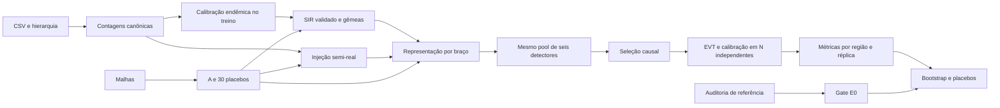

# HEADD-Series L0 — arquitetura e decisões de implementação

Data: 26/09/2026. Estado: proposta para revisão; nenhum componente implementado por este documento.

## 1. Objetivo, fontes e limites

Construir a bancada E1′ do README §5, com CDADE reconstruído, S + A, controle ε = 0, FAR de 1/60 por região-mês e 30 placebos. O resultado pode ser negativo. O prazo é 16/10/2026.

Fontes locais lidas: `AGENTS.md`, `README.md` e `pyproject.toml`, incluindo suas alterações ainda não commitadas. SHA-256 dessas versões:

| Arquivo | SHA-256 |
|---|---|
| AGENTS.md | `c45507dd2c81bec13acaf13e702c3bf5771747f5c86008e1c01242f11f9a15b3` |
| README.md | `e4b4af6ef16757e971477e6044255bfeae32eef41b3aaa0142eeb18de8d4104e` |
| pyproject.toml | `c4264a205f49cc4287a723cd47a728b4c363a09dd952e954d935c5ce6f1e3a3b` |

Referência CDADE: `/home/vinvs/projects/hybrid-theory`, commit **`fbfa609bba6cb0b0f2a9e8d73be18022aec319b7`**. As leituras de código usaram `git show HEAD:<path>`, não arquivos modificados do working tree. E0 deve fixar esse SHA completo, nunca resolver `HEAD` novamente durante uma execução. Os resultados locais não possuem, por si só, proveniência suficiente para certificar E0.

O projeto atual contém `main.py` demonstrativo, sem `src/`, `tests/` ou dados neste checkout. `.python-version` pede 3.12; `pyproject.toml` permite 3.11.13 e ainda não declara pytest, ruff, scipy ou pyarrow diretamente. Corrigir isso na implementação, preservando dependências e edições não relacionadas.

Não implementar M, REGIC, GNN, GANF/GDN, hhh4 completo, Tycho, L4/L5 ou SEIRS+ agent-based. B-Gao, B3/Φ e variante SEIRS são extensões condicionais, não dependências da entrega principal.

## 2. Alternativas e escolha

1. **Recomendada: pacote plano, funções numéricas e estado explícito.** Portar apenas componentes chamados e executar tudo em memória; TOML, dataclasses congeladas e dicionários locais. Facilita comparação de braços, testes e rastreabilidade.
2. Copiar o pipeline original completo: aproxima sua execução literal, mas reintroduz ferramentas proibidas e problemas identificados abaixo. Usar o original somente como oráculo isolado de caracterização.
3. Reescrever diretamente pelo artigo/protocolo: produz uma implementação científica nova, mas perde a alegação de paridade com CDADE. Exige decisão explícita caso o HEAD torne E0 inviável.

O plano adota 1, com uma auditoria inicial. Corrigir um erro metodológico não equivale a reproduzir o resultado original. Nenhuma correção recebe o rótulo de porte paritário sem o teste correspondente.

## 3. Divergências verificadas por leitura do HEAD

Estas são observações de código, não resultados de uma reprodução executada.

| ID | Evidência no commit de referência | Consequência e condição de desbloqueio |
|---|---|---|
| D1 | `cdade/detectors/run_detect.py:run_detect` ajusta e pontua a matriz completa; produz um score por mês, não por região e detector. | Não satisfaz causalidade nem as 14 tarefas. Auditoria deve mostrar os eixos e uma reprodução mínima. |
| D2 | `cdade/reconciliation/min_t.py:MinTReconciler` constrói S quadrada 13×13, usa identidade para W e não estima shrinkage. `summing_matrix.py` constrói corretamente 14×13. | MinT científico e saída literal desse código são contratos diferentes. Exigir decisão registrada antes do porte de MinT. |
| D3 | `cdade/detectors/mcd.py:MCDDetector.fit` usa um subconjunto aleatório e shrinkage, sem C-steps; PCA devolve `-PyODPCA.decision_function`. | FAST-MCD e orientação de score precisam de testes próprios. Mudanças de algoritmo/sinal podem impedir E0. |
| D4 | `cdade/reconciliation/evt.py:fit` desempacota `genpareto.fit` em dois valores; `cdade/baselines/reconciliation_evt.py:_fit_gpd` usa `(shape, loc, scale)` corretamente. | Caracterizar exceção; aproveitar a rotina funcional chamada por `run_baselines._run_b5`, sem confundir B5 original com B2 deste projeto. |
| D5 | `run_reconcile.py` reconcilia scores; AGENTS exige contagens. | Antes de integrar, decidir qual quantidade em unidades de contagem entra em MinT. Não inventar um previsor nem somar scores como se fossem casos. |
| D6 | `run_select.py` trata colunas como detectores e atribui a t uma janela que pode terminar depois de t. | O adaptador causal deve usar janelas encerradas em t−1 para selecionar em t; divergência de resultados deve ser registrada. |
| D7 | `run_evaluate.py` reduz máscaras e scores com `max(axis=1)` e calcula métricas por dataset. `results/metrics/sivep/metrics.json` local contém métodos, não 14 tarefas. | Não há evidência inspecionada que certifique a tabela exigida por E0. Recuperar uma tabela verificável ou declarar E0 bloqueado. |
| D8 | `evaluation/stats.py` continua DM/Cliff após Friedman não significativo, contém resultados substitutos e fallback HAC sem pesos Bartlett; bootstrap usa RandomState. | Portar rotinas válidas separadamente; fluxo científico, HAC e Generator requerem testes e registro de desvio. |
| D9 | `evaluation/metrics.py` usa AP como AUC-PR e um NAB simplificado com mediana dos scores avaliados. | AP mantém essa definição. NAB legado é apenas caracterização; E1 usa alarmes do limiar calibrado, sem mediana do teste. |

**Gate G0:** produzir `reference_audit.json` com reprodução, fontes, exceções e cobertura das 14 tarefas. Manter E0 bloqueado enquanto D1–D7 impedirem satisfazer simultaneamente referência, causalidade e contratos. Não criar um modo legado no pacote de produção para contornar o gate. A decisão humana pode autorizar uma revisão do protocolo; não pode transformar uma discrepância em paridade. A auditoria e componentes independentes continuam úteis enquanto isso.

## 4. Mapa de código e responsabilidade

Manter o layout do AGENTS. `tests/test_<module>.py` espelha cada módulo. Não criar serviços, factories, registry global ou camadas de repositório. Cada módulo mira 150–300 linhas e só se divide ao ultrapassar aproximadamente 400.

| Arquivo | Responsabilidade / tipos próprios |
|---|---|
| `src/headd_l0/data.py` | Ordem canônica, `Hierarchy`, `DataBundle`, leitura longa e contagens, proveniência dos CSVs. |
| `src/headd_l0/reconcile.py` | Única implementação de S; bottom-up e MinT; covariância estimada apenas de erros de treino fornecidos pelo chamador. |
| `src/headd_l0/detectors.py` | `DetectorConfig`, cinco wrappers mínimos PyOD e FAST-MCD próprio; `DETECTORS`. |
| `src/headd_l0/threshold.py` | `TailFit`, `Calibration`, POT/GPD e FAR; nenhuma dependência de rótulos T. |
| `src/headd_l0/select.py` | `SelectionConfig`, `SelectionResult`, competências, Q e ADWIN; `SELECTORS`. |
| `src/headd_l0/evaluate.py` | `DetectionOutcome`, AP, ROC-AUC, F1, NAB simplificado explicitamente nomeado, FAR e censura. |
| `src/headd_l0/stats.py` | Bootstrap por réplica/blocos, placebo rank e sequência secundária; `BootstrapResult`, `SecondaryResult`. |
| `src/headd_l0/graph.py` | Geometria → A → W, placebos, centralidades, exportação GEXF; importa S de `reconcile`, sem duplicá-la. |
| `src/headd_l0/features.py` | `FeatureBatch`, representação local/S/vizinhos e indicadores causais; eixos explícitos. |
| `src/headd_l0/simulate.py` | `SimConfig`, `SimResult`, `EndemicCalibration`, uma região, extensão acoplada e gêmeas. |
| `src/headd_l0/inject.py` | `InjectionConfig`, `InjectionResult`, protocolo original para E0 e propagado para E1 real. |
| `src/headd_l0/run.py` | `ExperimentConfig`, `ArmSpec`, `RunResult`, TOML, composição, seeds, artefatos e gates; CLI. |
| `scripts/export_cdade_reference.py` | Ferramenta exclusiva de auditoria/testes, executada em checkout exportado do SHA; não é dependência de produção. |
| `tests/reference/` | Pequenas fixtures determinísticas e seus manifests; nenhum resultado fabricado. |
| `configs/*.toml` | `data`, `e0_parity`, `l0_graph`, `sim_single`, `e1_bench`, `e1_real`; extensões só quando priorizadas. |
| `MIGRATION.md` | Criado na primeira tarefa: componente, caminho/SHA original, caminho novo, teste, tolerância, exclusões e divergências. |
| `notebooks/01_l0_network.ipynb`, `02_e1_results.ipynb` | Consomem resultados; não reimplementam métricas nem escolhem parâmetros. |

`summing_matrix` pertence a `reconcile.py`: resolve a duplicação entre layout de graph e contrato do reconciliador no AGENTS. Expor/reutilizar a mesma função onde necessário.

## 5. Contratos de dados e orientação

- Ordem: PA, ARAGUAIA, BAIXO AMAZONAS, CARAJAS, LAGO DE TUCURUI, MARAJO I, MARAJO II, METROPOLITANA I, METROPOLITANA II, METROPOLITANA III, RIO CAETES, TAPAJOS, TOCANTINS, XINGU. As matrizes regionais excluem PA.
- `Hierarchy(state: str, leaves: tuple[str, ...])`, congelada; `DataBundle(long: pd.DataFrame, counts: np.ndarray, state_counts: np.ndarray, tests: np.ndarray, months: pd.DatetimeIndex, hierarchy: Hierarchy)`, congelada. Arrays congelados por convenção/read-only para impedir mutação entre braços.
- `long`: `region, month, species, count`; preservar rótulos originais. `counts` e `tests`: `[13,132]`; `state_counts`: `[132]`; inteiros não negativos. `tests` inclui negativos; `counts` soma todos os resultados diferentes de `negative`, exatamente como o original.
- S `[14,13]`, primeira linha de uns; A/W `[13,13]`; contagens coerentes `S @ counts`. Amostras de detectores sempre `[n_samples,n_features]`, scores `[n_samples]`.
- `FeatureBatch(values: np.ndarray, months: np.ndarray, names: tuple[str,...])`: values `[n_nodes,n_months,n_features]`. Scores do pool `[n_nodes,n_months,6]`. Jamais reinterpretar regiões como detectores.
- `SimResult(counts, twin_counts, onset, seed_region, label, params)` congelada: counts/twin `[n_regions,132]`, onset `[n_regions]` inteiro; `-1` significa sem onset. Uma região só no gate de validação; produção tem 13. `params` serializável inclui parâmetros efetivos e hash do estado inicial do Generator; o runner associa esse resultado à entropy/spawn_key do manifesto, sem tentar recuperar uma seed a partir do Generator.
- Ausência de espécie numa região-mês observada pode virar zero; ausência do mês inteiro ou de uma região é erro. Não interpolar silenciosamente. A tabela contém rótulos adicionais como `FG`, `F+FG`, `non falciparum`; o mapeamento Φ exige uma tabela documentada, não um teste de substring.

Os CSVs foram encontrados no working tree de `hybrid-theory/data/raw/`, não como arquivos rastreados nesse SHA:

| Arquivo | Linhas | SHA-256 |
|---|---:|---|
| PA.csv | 132 | `ba437eff83a537addcdda93aca09401d5033804b83a0b767baa55788267041f5` |
| PASIVEPDailyPerHr.csv | 7.592 | `ad61c77c8c187713cd47e72bb5f028eda1203e3f5e4962c5970d41abd9ae7188` |

A leitura com biblioteca padrão verificou 13 regiões e diferenças `(positivos, testes) = (0,0)` nos 132 meses. Ainda não é um teste do novo loader. Como `data/raw/` é imutável e está ausente aqui, usar o diretório original em modo leitura na primeira execução. Materialização inicial no novo repositório exige que o usuário disponibilize/autorize a inclusão dos arquivos; nunca sobrescrever dados existentes.

## 6. Composição dos braços e causalidade

O diagrama não fixa a posição de MinT: **D5 bloqueia essa conexão**. A entrada de `reconcile` é uma quantidade em unidades de contagem e seus erros de treino. Se a única entrada forem as próprias contagens já coerentes, MinT deve ser identidade nessa entrada; não alegar uma etapa de previsão inexistente. A auditoria deve apresentar esse fato e obter uma definição de baseline executável antes da integração B1. Componentes numéricos podem ser construídos/testados independentemente.

`ArmSpec(name, use_hierarchy, graph_id)` define: B0 `(false,None)`, B1 `(true,None)`, B2 `(true,"observed")`, B2-placebo `(true,"placebo_00"..."placebo_29")`. B0 usa modelos independentes por região. B1/B2/placebos compartilham arquitetura, algoritmos, hiperparâmetros, partições e seeds; parâmetros aprendidos e limiares numéricos podem diferir porque as representações diferem. Não exigir o mesmo valor numérico de threshold.

Fit de detector, escalador, covariância e calibração ocorre só em treino/calibração independente. Seleção em t usa exclusivamente scores até t−1 e pseudo-rótulos, nunca onset/máscara; reset atualiza o estado a partir daquele instante, sem revisar o passado. Features contemporâneas `W·x_t` são permitidas pelo contrato ≤t; adicionar teste de invariância a qualquer sufixo futuro.

Representação local proposta: contagem t, t−1 e diferença temporal; S disponibiliza agregado PA e contraste `x_i−PA/13`, ambos em unidades de contagem. A posição de MinT depende de D5. Evitar divisões por contagem regional e proporções reconciliadas. Extensão de vizinhança: `W·x_t`, `W·x_(t−1)`, `x_t−W·x_t`, Moran local por mês suavizado por janela causal de 12 meses. B1 não recebe essas quatro colunas; B2 e placebo têm nomes/dimensões idênticos. Sem vizinhos para PA: suas colunas relacionais recebem zero em todos os braços com S.

## 7. Decisões experimentais propostas para revisão

Os valores fixados por README/AGENTS são obrigatórios. Os seguintes complementos são **propostas**, não valores recuperados do CDADE nem escolhas já pré-registradas. Registrar a aprovação em `docs/protocol-decisions.md` antes de rodar a bancada final.

| Decisão | Proposta concreta | Motivo / teste |
|---|---|---|
| Lead time | Publicar `delay = alarm−onset` e `lead = onset−alarm`; Δ principal é `lead_B2−lead_B1`. | Resolver a ambiguidade do texto: Δ positivo significa detecção mais cedo. |
| Janela / censura | Janela `[onset−12,onset+12]`, limitada à observação; primeiro alarme nela. Sem alarme: `detected=false`, tempo censurado no fim+1; usar esse tempo restrito no bootstrap e publicar probabilidade de detecção separadamente. | Não descartar falhas nem transformar ausência de onset em surto perdido. |
| ε e janela de treino | ε = `[0.0,0.05,0.20]`; meses 0–59 de treino; monitoramento 60–131; surto sem cruzamento durante treino. | Baixo/alto não são numericamente fixados no README. Valores só mudam por revisão prévia, nunca pelo efeito observado. |
| Amostragem | 500 T + 500 N de avaliação por ruído×ε = 9.000; **mais** 200 N de calibração por célula = 1.800, com seeds disjuntas. | As gêmeas T não são réplicas N independentes; não reutilizar calibração na estimativa de FAR. |
| Seeds | raiz 42; subárvores estáveis para dados, calibração, avaliação, placebos, detectores e bootstrap. Registrar entropy, spawn_key e seed inteira quando biblioteca a exigir. | Reordenar braços não muda dados, gráficos ou bootstrap. |
| Bootstrap | 10.000 reamostragens, IC percentil 95%; unidade = réplica, com suas 13 regiões juntas; estratificar ε e ruído. | Não tratar 13 regiões correlacionadas como 13 réplicas independentes. |
| Controle ε = 0 | Reportar IC e teste de equivalência com margem proposta ±1 mês. Sem equivalência, critério de ausência de ganho não foi demonstrado. | Falta de significância não prova ausência de efeito; margem exige revisão científica. |
| Placebo rank | Fração estrita de placebos superados por B2 na mesma estatística; empates não contam. `29/30 > .95`; `28/30` não. | É posição descritiva, não chamar essa fração de p-valor. |
| FAR | Um alarme = um mês-região acima do limiar; sem cooldown implícito. Ajustar por braço/região em N de calibração; alvo 1/60. | Avaliação N separada: reportar FAR e IC por blocos, incluindo desvio do alvo; bloquear interpretação se comparabilidade falhar. |
| Geografia | Queen é primária. Se desconexa, falhar e produzir diagnóstico; k-NN simétrico de centróides é variante identificada e exige pré-registro. | Não ligar ilhas arbitrariamente nem chamar grafo corrigido de queen puro. |

Definir, no mesmo registro antes da implementação metapopulacional, Nᵢ (populações efetivas, não inferidas só de casos), θ, β₀/β₁, µ/γ, intensidade de cada ruído, sazonalidade e SD usada no onset. Proposta para a SD: desvio-padrão da série observada da gêmea nos 60 meses de treino, congelado; não SD do excesso pré-surto (que pode ser identicamente zero com números comuns). Estimar νᵢ só das medianas de treino, condicionado aos parâmetros fixados; ν e θ não são identificáveis separadamente por essas medianas. Essa definição quantitativa é um gate de desenho, com fonte e teste, não um default escondido no código.

## 8. Grafo, simulação e features

Verificar 13 nomes e códigos de regiões de saúde, não CRS ou municípios; dissolver geometria municipal explicitamente quando necessário, preservar CRS e hash da fonte. Há um relato dos mantenedores de que `geometry_level` podia retornar municípios na implementação Python; o teste deve verificar o resultado, independentemente da versão instalada ([geobr #448](https://github.com/ipea/geobr/issues/448)). Queen: A simétrica/binária/diagonal zero; W normalizada por linha. Conectividade é pré-condição da geração de placebos.

Rewiring com trocas duplas, graus por nó preservados, sem loops/arestas duplicadas, rejeitando desconexão. Rejeitar A original e duplicatas entre os 30 draws; orçamento explícito de tentativas e erro se insuficiente. Gravar A e placebos, hashes, seeds, trocas aceitas e orçamento; não prometer amostragem uniforme das realizações gráficas.

O modelo de uma região precede o acoplamento: verificar SDEs 1–3, escalas temporais e observável I no [suplemento de Gao](https://journals.plos.org/ploscompbiol/article/file?id=10.1371/journal.pcbi.1012782.s001&type=supplementary). O artigo disponibiliza código/dados no [Zenodo](https://doi.org/10.5281/zenodo.10967222), referência para fixtures. A adaptação a incidência mensal observada é um segundo teste; não somar prevalências semanais e chamar o resultado de novos casos.

Na extensão, aplicar `C=(1−ε)I+εW`, `λ_i=β_i(t)Σ_j C_ij I_j/N_j`; introduzir ν e sazonalidade documentados. Uma semana = 7 dias; integrar o último intervalo parcial e distribuir fluxos aos meses do calendário. Registrar clipping de compartimentos e frequência de projeções; incidência inteira antes da observação binomial, com a regra de discretização pré-registrada.

Números comuns significam as mesmas inovações por `(réplica,semana,região,canal)`, incluindo observação; apenas reutilizar um seed com chamadas condicionais não garante isso. Usar inovações de tamanho fixo e quantis binomiais comuns para estados diferentes. ε=0 deve dar igualdade exata outbreak/twin nas regiões não sementes. Rótulos e onset nunca entram nas features.

SD, CV, AR1, skewness e kurtosis têm janela causal e máscara de validade. Janela sem variância/média: zero determinístico com indicador de validade, documentado; não gerar infinito. Teste de separação T/N usa apenas janelas pré-onset definidas no experimento de validação.

## 9. Artefatos, dependências e verificação

`results/<run_id>/manifest.json`: config resolvida/hash, SHA do projeto e estado dirty, SHA CDADE, versões/lock hash, timestamp UTC, seeds completas, hashes dos dados/grafos, partições, parâmetros científicos, status dos gates, caminhos e hashes dos artefatos. `metrics.parquet`: `experiment,arm,graph_id,noise,epsilon,replicate,region,metric,value,status`. `scores.parquet`, `onsets.parquet`, `calibration.parquet`, `statistics.json` preservam auditoria. Não sobrescrever run_id existente.

`data/processed/` guarda longa, geometrias, calibração endêmica e cache regenerável. O manifesto do run referencia seus hashes. Componentes numéricos não fazem I/O; o runner é responsável por salvar seus outputs. Isso satisfaz a definição de pronto sem acoplar cada função ao filesystem.

Adicionar apenas via `uv add`: scipy/pyarrow na primeira tarefa; pytest/ruff em dev; PyOD para os cinco detectores já usados e river para ADWIN nas tarefas donas. Não introduzir framework para eliminar essas duas bibliotecas pequenas à custa de paridade. Resolver versões e registrar conflitos com os pisos atuais; não baixar versões silenciosamente. Bibliotecas geográficas/networkx já declaradas são aproveitadas. Não remover openpyxl/pymnet/igraph/pmdarima neste trabalho de planejamento.

Testes rápidos sem rede; integração geográfica/fixtures originais marcada; simulador `slow`; reprodução completa E0 e bancada fora do pytest padrão. Ausência de dados/oráculo pode dar skip só em testes opcionais; comandos de gate devem falhar explicitamente. Checks: `uv run ruff check .`, `uv run ruff format --check .`, `uv run pytest` e testes científicos da etapa. Commits locais convencionais; sem push.

## 10. Questões que impedem execução automática

1. Resolver G0/D1–D7 com evidência e revisão do baseline: HEAD e protocolo não são hoje intercambiáveis.
2. Aprovar as convenções da §7 e parâmetros numéricos da simulação antes de E1; documentar se o critério de equivalência é aceito.
3. Definir representação de contagem para MinT (D5); não autorizar integração com um contrato em branco.
4. Obter malha com 13 regiões e conectividade compatível, ou registrar a variante antes dos placebos.

Esses gates não impedem entregar o plano global, auditar o original, escrever testes dos componentes isolados ou construir S/A. Impedem anunciar baseline paritário e interpretar E1′. Os planos associados descrevem tarefas condicionais com critérios objetivos de entrada/saída.
